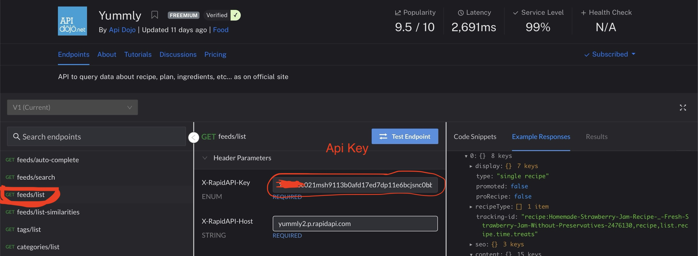
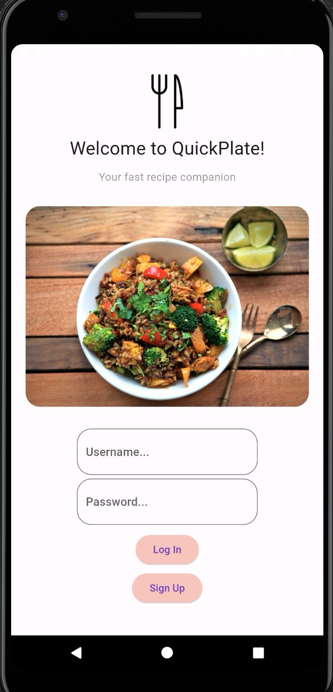

# QuickPlates - A Recipe and Meal Planning App
### Your Fast Recipe Companion
##### Team MadMobile - Saif Farooqi and Shota Osada

## Description

QuickPlates is a recipe and meal planning app which aims to deliver a user friendly experience for viewing recipes. It does so by having a global recipes page which displays different recipes each time the page is refreshed, allowing for a variety of recipes to be seen. 
Users are able to perform a variety of options, such as viewing individual recipes, adding it to their liked list, and quick-adding the ingredients to their personal grocery list. Users are able to create locally stored user logins, and after successfully logging in to the app they can navigate through the various pages by utilizing the menu located in the top left.


## Installation + Getting Started


1. **Clone the repository:**

   ```bash
   git clone https://github.com/sxyf17/RecipeApp.git

2. **Navigate to the app:**

    ```bash
    cd RecipeApp

3. **Install dependencies**

    ```bash
    flutter pub get

4. **Visit https://rapidapi.com/apidojo/api/yummly2 for api access key**
 - **Important: First create free account for 500 api calls/month. Api Key will not work until account created and subscirbed to one of the plans**
- navigate back to https://rapidapi.com/apidojo/api/yummly2 yummly page
- select feeds/list, copy api code in 'X-rapidapiAPI-Key'


5. **Add API key to config.dart file**
 - navigate to lib folder in project, open config.dart or create if not already existing
    ```bash
    cd lib/
    code config.dart

- add following line to file, then save:
    ```bash
    const String apiKey = '{YOUR API KEY HERE}';

6. **Now, run project**
- either type 'flutter run' and select android device 
    ```bash
    flutter run
- or run in vscode, press Command+Shift+P (Mac)
or Control+Shift+P (Windows) to select android device
- press 'Run>Run Without Debugging' in top of window

&. **Start Using App**
- remember to sign up first before logging in.




# Youtube link
https://www.youtube.com/watch?v=DqWTNs_9UzU

# Github link
https://github.com/sxyf17/RecipeApp

# Presentation
https://docs.google.com/presentation/d/1MdeOPpuv1vINR6iUSkCI4ktGUEQnbcV43PZv-5LnXyc/edit#slide=id.g1f87997393_0_1544